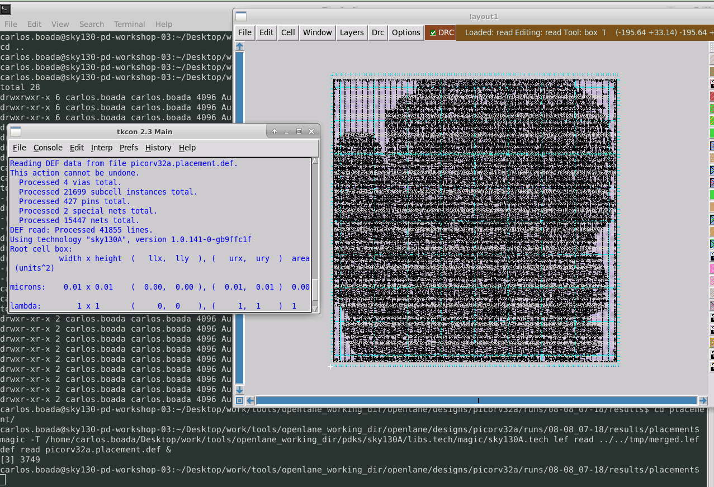

# Advanced-Physical-Design-Using-OpenLANE-Sky130-Workshop
Repository corresponding to the work carried out in the VSD-IAT SKY130/Physical Design Workshop during 5 days of the month of August 2022

# Day 1

`Desktop/work/tools/openlane_working_dir/openlane$ ls -ltr`

`&docker`

`bash-4.2$./flow.tcl -interactive` 

`%package require openlane 0.9`

`%prep -design picorv32a`

`run_synthesis`

--

$$\textit{Number of cells}=14876$$ 

$$\textit{Total number of flops}=1613$$

$$\textit{Flop ration}:(\textit{Total number of flops}/\textit{Number of cells})*100=10.84$$

$$buf_1=1656$$

$$buf_2=8$$

$$ \textit{Buffer ratio}: \frac{(buf_1+buf_2)}{\textit{Number of cells}}=11.18$$ 

# Day 2

Open the file README.md located in openlane configuration

run_floorplan

run_placement

`magic -T /home/carlos.boada/Desktop/work/tools/openlane_working_dir/pdks/sky130A/libs.tech/magic/sky130A.tech lef read ../../tmp/merged.lef def read picorv32a.placement.def &`

# Day 3

The file is cloned in the openlane folder 
`git clone https://github.com/nickson-jose/vsdstdcelldesign.git`

then copy the file sky130A.tech in the current folder and proceed to launch

`magic -T sky130A.tech sky130_inv.mag &`

